Air Pollution in Seoul
================
Jin Seo Jo

``` r
library(tidyverse)
library(here)
library(ggpubr)
```

## 1\. Road original data files.

``` r
info <- read.csv(here("Original Data", "Measurement_info.csv"), header = TRUE)

item_info <- read.csv(here("Original Data", "Measurement_item_info.csv"), header = TRUE)

station_info <- read.csv(here("Original Data", "Measurement_station_info.csv"), header = TRUE)

measurement_summary <- read.csv(here("Measurement_summary.csv"), header = TRUE)
```

## 2\. Extract the data of the items.

``` r
so2_info <- filter(info, Item.code == 1)
no2_info <- filter(info, Item.code == 3)
co_info <- filter(info, Item.code == 5)
o3_info <- filter(info, Item.code == 6)
pm10_info <- filter(info, Item.code == 8)
pm2.5_info <- filter(info, Item.code == 9)
```

### 2.1. SO2 Analysis

Note: We have 25 data for every hour since the data were measured for 25
districts in Seoul.

Since the data is big, we will group it by month and year.

Find daily average: For each day, find the average value of the 25
districts.

``` r
so2_daily_avg <- so2_info %>% 
  mutate(singledt = as.Date(substr(Measurement.date, 1, 10))) %>% 
  group_by(singledt, Station.code) %>% 
  summarize(daily_avg = mean(Average.value)) %>% 
  mutate(so2_count = factor(ifelse(daily_avg <= 0.02, "Good",
                            ifelse(daily_avg > 0.02 & daily_avg <= 0.05, "Normal",
                            ifelse(daily_avg > 0.05 & daily_avg <= 0.15, "Bad",
                            "Very Bad"))),
                            levels = c("Good", "Normal", "Bad", "Very Bad")))

so2_daily_count <- so2_daily_avg %>% 
  group_by(so2_count) %>%
  summarise(total = n()) %>% 
  complete(so2_count, fill = list(total = 0)) # this line indludes the empty level of the column and replaces the 'NA' with '0'

ggplot(so2_daily_count, aes(x = so2_count, y = total, fill = so2_count)) + 
  geom_bar(stat = "identity") +
  scale_fill_manual(values = c("Good" = "blue", "Normal" =  "green", "Bad" = "yellow", "Very Bad" = "red")) +
  geom_text(aes(label = total), vjust = -0.3, size = 3.5) +
  theme_minimal() +
  labs(x = "SO2 status", y="Count") +
  labs(fill = "SO2 status")
```

<!-- -->

The bar chart shows that most SO2 values are considered Good.

Find yearly average:

``` r
so2_info %>% 
  mutate(singleyr = substr(Measurement.date, 1, 4)) %>% 
  group_by(singleyr, Station.code) %>% 
  summarize(yr_avg_in_dist = mean(Average.value)) %>% 
  group_by(singleyr) %>% 
  summarize(yearly_avg = mean(yr_avg_in_dist))
```

    ## # A tibble: 3 x 2
    ##   singleyr yearly_avg
    ##   <chr>         <dbl>
    ## 1 2017        0.00321
    ## 2 2018       -0.00110
    ## 3 2019       -0.00775

Yearly average shows that the SO2 values are decreasing.

### 2.2. NO2 Analysis

Daily average:

``` r
no2_daily_avg <- no2_info %>% 
  mutate(singledt = as.Date(substr(Measurement.date, 1, 10))) %>% 
  group_by(singledt, Station.code) %>% 
  summarize(daily_avg = mean(Average.value)) %>% 
  mutate(no2_count = factor(ifelse(daily_avg <= 0.03, "Good",
                            ifelse(daily_avg > 0.03 & daily_avg <= 0.06, "Normal",
                            ifelse(daily_avg > 0.06 & daily_avg <= 0.20, "Bad",
                            "Very Bad"))),
                            levels = c("Good", "Normal", "Bad", "Very Bad")))

no2_daily_count <- no2_daily_avg %>% 
  group_by(no2_count) %>%
  summarise(total = n()) %>% 
  complete(no2_count, fill = list(total = 0))

ggplot(no2_daily_count, aes(x = no2_count, y = total, fill = no2_count)) + 
  geom_bar(stat = "identity") +
  scale_fill_manual(values = c("Good" = "blue", "Normal" =  "green", "Bad" = "yellow", "Very Bad" = "red")) +
  geom_text(aes(label = total), vjust = -0.3, size = 3.5) +
  theme_minimal() +
  labs(x = "NO2 status", y="Count") +
  labs(fill = "NO2 status")
```

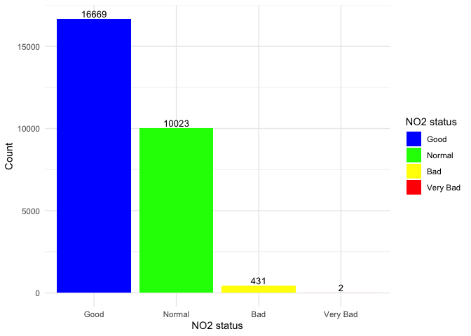<!-- -->

The bar chart shows that most NO2 values are considered Good and Normal.

Yearly average:

``` r
no2_info %>% 
  mutate(singleyr = substr(Measurement.date, 1, 4)) %>% 
  group_by(singleyr, Station.code) %>% 
  summarize(yr_avg_in_dist = mean(Average.value)) %>% 
  group_by(singleyr) %>% 
  summarize(yearly_avg = mean(yr_avg_in_dist))
```

    ## # A tibble: 3 x 2
    ##   singleyr yearly_avg
    ##   <chr>         <dbl>
    ## 1 2017         0.0279
    ## 2 2018         0.0235
    ## 3 2019         0.0159

Yearly average shows that the NO2 values are decreasing.

### 2.3. CO Analysis

Daily average:

``` r
co_daily_avg <- co_info %>% 
  mutate(singledt = as.Date(substr(Measurement.date, 1, 10))) %>% 
  group_by(singledt, Station.code) %>% 
  summarize(daily_avg = mean(Average.value)) %>% 
  mutate(co_count = factor(ifelse(daily_avg <= 2.00, "Good",
                            ifelse(daily_avg > 2.00 & daily_avg <= 9.00, "Normal",
                            ifelse(daily_avg > 9.00 & daily_avg <= 15.00, "Bad",
                            "Very Bad"))),
                           levels = c("Good", "Normal", "Bad", "Very Bad")))

co_daily_count <- co_daily_avg %>% 
  group_by(co_count) %>%
  summarise(total = n()) %>% 
  complete(co_count, fill = list(total = 0))

ggplot(co_daily_count, aes(x = co_count, y = total, fill = co_count)) + 
  geom_bar(stat = "identity") +
  scale_fill_manual(values = c("Good" = "blue", "Normal" =  "green", "Bad" = "yellow", "Very Bad" = "red")) +
  geom_text(aes(label = total), vjust = -0.3, size = 3.5) +
  theme_minimal() +
  labs(x = "CO status", y="Count") +
  labs(fill = "CO status")
```

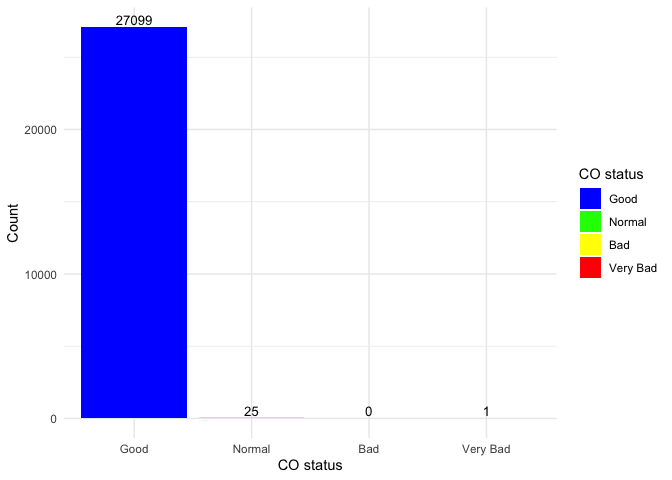<!-- -->

The bar chart shows that most CO values are considered Good.

Yearly average:

``` r
co_info %>% 
  mutate(singleyr = substr(Measurement.date, 1, 4)) %>% 
  group_by(singleyr, Station.code) %>% 
  summarise(yr_avg_in_dist = mean(Average.value)) %>% 
  group_by(singleyr) %>% 
  summarise(yearly_avg = mean(yr_avg_in_dist))
```

    ## # A tibble: 3 x 2
    ##   singleyr yearly_avg
    ##   <chr>         <dbl>
    ## 1 2017          0.518
    ## 2 2018          0.495
    ## 3 2019          0.515

Yearly average shows that the NO2 values are stable.

### 2.4. O3 Analysis

Daily average:

``` r
o3_daily_avg <- o3_info %>% 
  mutate(singledt = as.Date(substr(Measurement.date, 1, 10))) %>% 
  group_by(singledt, Station.code) %>% 
  summarize(daily_avg = mean(Average.value)) %>% 
  mutate(o3_count = factor(ifelse(daily_avg <= 0.03, "Good",
                            ifelse(daily_avg > 0.03 & daily_avg <= 0.09, "Normal",
                            ifelse(daily_avg > 0.09 & daily_avg <= 0.15, "Bad",
                            "Very Bad"))),
                           levels = c("Good", "Normal", "Bad", "Very Bad")))

o3_daily_count <- o3_daily_avg %>% 
  group_by(o3_count) %>%
  summarise(total = n()) %>% 
  complete(o3_count, fill = list(total = 0))

ggplot(o3_daily_count, aes(x = o3_count, y = total, fill = o3_count)) + 
  geom_bar(stat = "identity") +
  scale_fill_manual(values = c("Good" = "blue", "Normal" =  "green", "Bad" = "yellow", "Very Bad" = "red")) +
  geom_text(aes(label = total), vjust = -0.3, size = 3.5) +
  theme_minimal() +
  labs(x = "O3 status", y="Count") +
  labs(fill = "O3 status")
```

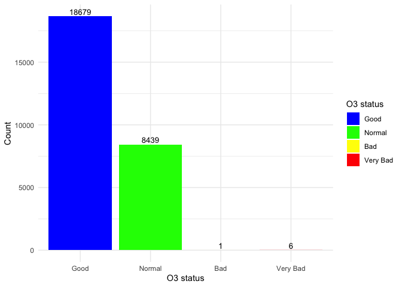<!-- -->

The bar chart shows that most CO values are considered Good and Normal.

Yearly average:

``` r
o3_info %>% 
  mutate(singleyr = substr(Measurement.date, 1, 4)) %>% 
  group_by(singleyr, Station.code) %>% 
  summarize(yr_avg_in_dist = mean(Average.value)) %>% 
  group_by(singleyr) %>% 
  summarize(yearly_avg = mean(yr_avg_in_dist))
```

    ## # A tibble: 3 x 2
    ##   singleyr yearly_avg
    ##   <chr>         <dbl>
    ## 1 2017         0.0231
    ## 2 2018         0.0181
    ## 3 2019         0.0125

Yearly average shows that the O3 values are slightly decreasing.

### 2.5. PM10 Analysis

Daily average:

``` r
pm10_daily_avg <- pm10_info %>% 
  mutate(singledt = as.Date(substr(Measurement.date, 1, 10))) %>% 
  group_by(singledt, Station.code) %>% 
  summarize(daily_avg = mean(Average.value)) %>% 
  mutate(pm10_count = factor(ifelse(daily_avg <= 30.00, "Good",
                            ifelse(daily_avg > 30.00 & daily_avg <= 80.00, "Normal",
                            ifelse(daily_avg > 80.00 & daily_avg <= 150.00, "Bad",
                            "Very Bad"))),
                            levels = c("Good", "Normal", "Bad", "Very Bad")))

pm10_daily_count <- pm10_daily_avg %>% 
  group_by(pm10_count) %>%
  summarise(total = n()) %>% 
  complete(pm10_count, fill = list(total = 0))

ggplot(pm10_daily_count, aes(x = pm10_count, y = total, fill = pm10_count)) + 
  geom_bar(stat = "identity") +
  scale_fill_manual(values = c("Good" = "blue", "Normal" =  "green", "Bad" = "yellow", "Very Bad" = "red")) +
  geom_text(aes(label = total), vjust = -0.3, size = 3.5) +
  theme_minimal() +
  labs(x = "PM10 status", y="Count") +
  labs(fill = "PM10 status")
```

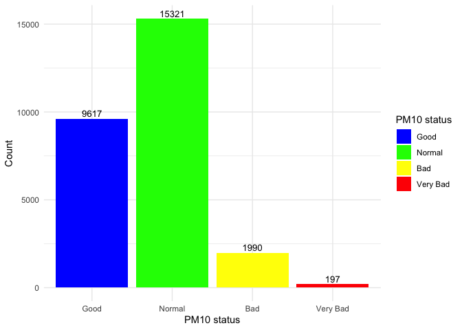<!-- -->

The bar chart shows that some CO values are considered Bad and Very Bad.

Yearly average:

``` r
pm10_info %>% 
  mutate(singleyr = substr(Measurement.date, 1, 4)) %>% 
  group_by(singleyr, Station.code) %>% 
  summarize(yr_avg_in_dist = mean(Average.value)) %>% 
  group_by(singleyr) %>% 
  summarize(yearly_avg = mean(yr_avg_in_dist))
```

    ## # A tibble: 3 x 2
    ##   singleyr yearly_avg
    ##   <chr>         <dbl>
    ## 1 2017           44.4
    ## 2 2018           41.8
    ## 3 2019           45.0

Yearly average shows that the NO2 values are stable.

### 2.6. PM2.5 Analysis

Daily average:

``` r
pm2.5_daily_avg <- pm2.5_info %>% 
  mutate(singledt = as.Date(substr(Measurement.date, 1, 10))) %>% 
  group_by(singledt, Station.code) %>% 
  summarize(daily_avg = mean(Average.value)) %>% 
  mutate(pm2.5_count = factor(ifelse(daily_avg <= 15.00, "Good",
                            ifelse(daily_avg > 15.00 & daily_avg <= 35.00, "Normal",
                            ifelse(daily_avg > 35.00 & daily_avg <= 75.00, "Bad",
                            "Very Bad"))),
                            levels = c("Good", "Normal", "Bad", "Very Bad")))

pm2.5_daily_count <- pm2.5_daily_avg %>% 
  group_by(pm2.5_count) %>%
  summarise(total = n()) %>% 
  complete(pm2.5_count, fill = list(total = 0))

ggplot(pm2.5_daily_count, aes(x = pm2.5_count, y = total, fill = pm2.5_count)) + 
  geom_bar(stat = "identity") +
  scale_fill_manual(values = c("Good" = "blue", "Normal" =  "green", "Bad" = "yellow", "Very Bad" = "red")) +
  geom_text(aes(label = total), vjust = -0.3, size = 3.5) +
  theme_minimal() +
  labs(x = "PM2.5 status", y="Count") +
  labs(fill = "PM2.5 status") 
```

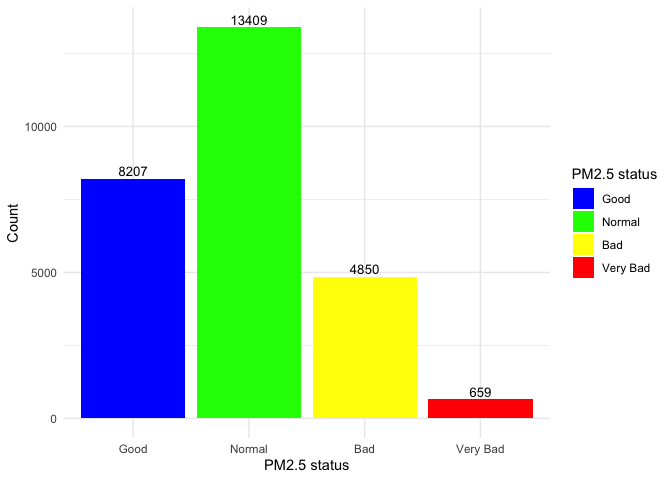<!-- -->

The bar chart shows that some CO values are considered Bad and Very Bad.

Yearly average:

``` r
pm2.5_info %>% 
  mutate(singleyr = substr(Measurement.date, 1, 4)) %>% 
  group_by(singleyr, Station.code) %>% 
  summarize(yr_avg_in_dist = mean(Average.value)) %>% 
  group_by(singleyr) %>% 
  summarize(yearly_avg = mean(yr_avg_in_dist))
```

    ## # A tibble: 3 x 2
    ##   singleyr yearly_avg
    ##   <chr>         <dbl>
    ## 1 2017           24.6
    ## 2 2018           24.1
    ## 3 2019           27.6

Yearly average shows that the NO2 values are increasing.

## 3\. Seasonal trends

### 3.1. SO2 seasonal trend

``` r
so2_monthly_avg <- so2_daily_avg %>% 
  mutate(month = substr(singledt, 1, 7)) %>% 
  group_by(month) %>% 
  summarize(monthly_avg = mean(daily_avg)) %>% 
  mutate(month_num = as.numeric(substr(month, 6, 7)),
         year_num = as.numeric(substr(month, 1, 4)))

ggplot(so2_monthly_avg, aes(x = month_num, 
                            y = monthly_avg, 
                            group = year_num, 
                            colour = factor(year_num))) +
  geom_line() +
  geom_point() +
  scale_x_continuous(breaks=c(1:12)) +
  labs(x = "Month Number", y = "SO2 Average") +
  labs(colour = "Year")
```

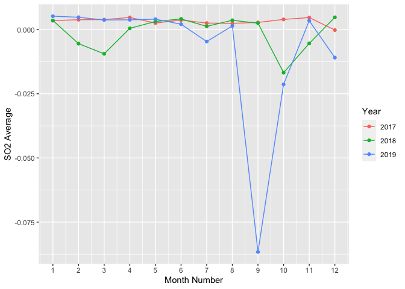<!-- -->

### 3.2. NO2 seasonal trend

``` r
no2_monthly_avg <- no2_daily_avg %>% 
  mutate(month = substr(singledt, 1, 7)) %>% 
  group_by(month) %>% 
  summarize(monthly_avg = mean(daily_avg)) %>% 
  mutate(month_num = as.numeric(substr(month, 6, 7)),
         year_num = as.numeric(substr(month, 1, 4)))

ggplot(no2_monthly_avg, aes(x = month_num, 
                            y = monthly_avg, 
                            group = year_num, 
                            colour = factor(year_num))) +
  geom_line() +
  geom_point() +
  scale_x_continuous(breaks=c(1:12)) +
  labs(x = "Month Number", y = "NO2 Average") +
  labs(colour = "Year")
```

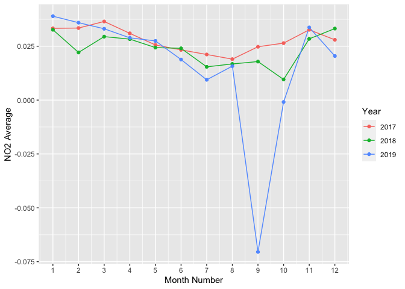<!-- -->

### 3.3. CO seasonal trend

``` r
co_monthly_avg <- co_daily_avg %>% 
  mutate(month = substr(singledt, 1, 7)) %>% 
  group_by(month) %>% 
  summarize(monthly_avg = mean(daily_avg)) %>% 
  mutate(month_num = as.numeric(substr(month, 6, 7)),
         year_num = as.numeric(substr(month, 1, 4)))

ggplot(co_monthly_avg, aes(x = month_num, 
                           y = monthly_avg, 
                           group = year_num, 
                           colour = factor(year_num))) +
  geom_line() +
  geom_point() +
  scale_x_continuous(breaks=c(1:12)) +
  labs(x = "Month Number", y = "CO Average") +
  labs(colour = "Year")
```

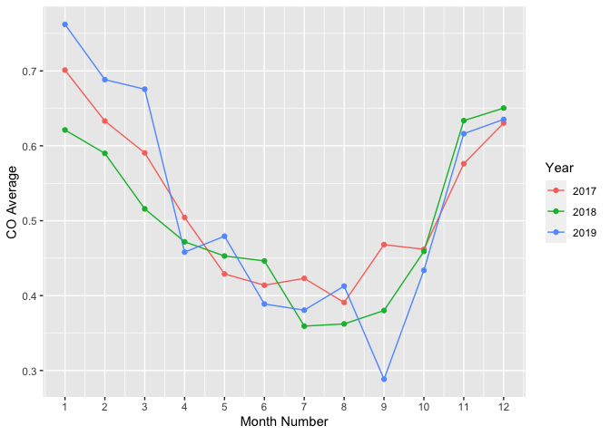<!-- -->

### 3.4. O3 seasonal trend

``` r
o3_monthly_avg <- o3_daily_avg %>% 
  mutate(month = substr(singledt, 1, 7)) %>% 
  group_by(month) %>% 
  summarize(monthly_avg = mean(daily_avg)) %>% 
  mutate(month_num = as.numeric(substr(month, 6, 7)),
         year_num = as.numeric(substr(month, 1, 4)))

ggplot(o3_monthly_avg, aes(x = month_num, 
                           y = monthly_avg, 
                           group = year_num, 
                           colour = factor(year_num))) +
  geom_line() +
  geom_point() +
  scale_x_continuous(breaks=c(1:12)) +
  labs(x = "Month Number", y = "O3 Average") +
  labs(colour = "Year")
```

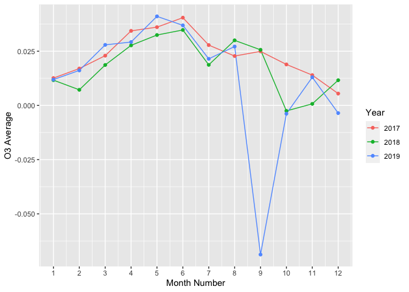<!-- -->

### 3.5. PM10 seasonal trend

``` r
pm10_monthly_avg <- pm10_daily_avg %>% 
  mutate(month = substr(singledt, 1, 7)) %>% 
  group_by(month) %>% 
  summarize(monthly_avg = mean(daily_avg)) %>% 
  mutate(month_num = as.numeric(substr(month, 6, 7)),
         year_num = as.numeric(substr(month, 1, 4)))

ggplot(pm10_monthly_avg, aes(x = month_num, 
                             y = monthly_avg, 
                             group = year_num, 
                             colour = factor(year_num))) +
  geom_line() +
  geom_point() +
  scale_x_continuous(breaks=c(1:12)) +
  labs(x = "Month Number", y = "PM10 Average") +
  labs(colour = "Year")
```

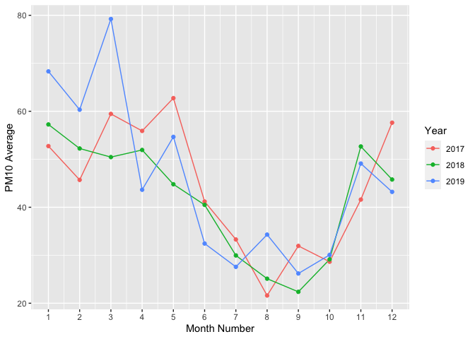<!-- -->

### 3.6. PM2.5 seasonal trend

``` r
pm2.5_monthly_avg <- pm2.5_daily_avg %>% 
  mutate(month = substr(singledt, 1, 7)) %>% 
  group_by(month) %>% 
  summarize(monthly_avg = mean(daily_avg)) %>% 
  mutate(month_num = as.numeric(substr(month, 6, 7)),
         year_num = as.numeric(substr(month, 1, 4)))

ggplot(pm2.5_monthly_avg, aes(x = month_num, 
                              y = monthly_avg, 
                              group = year_num, 
                              colour = factor(year_num))) +
  geom_line() +
  geom_point() +
  scale_x_continuous(breaks=c(1:12)) +
  labs(x = "Month Number", y = "PM2.5 Average") +
  labs(colour = "Year")
```

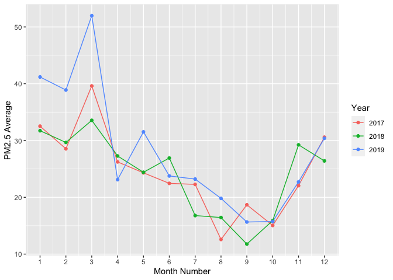<!-- -->

## 4\. Geographic Visualization

``` r
library(ggmap)
```

Plots for 25 districts:

``` r
register_google(key = "My API Key")

cen <- c(mean(station_info$Longitude), mean(station_info$Latitude))

gc <- station_info %>% 
  select(Longitude, Latitude)

map <- get_googlemap(center = cen,
                     zoom = 11,
                     maptype = "roadmap",
                     markers = gc)

ggmap(map) +
  geom_point(aes(x = Longitude, y = Latitude), data = gc, size = 3, colour = "red") +
  theme_void()
```

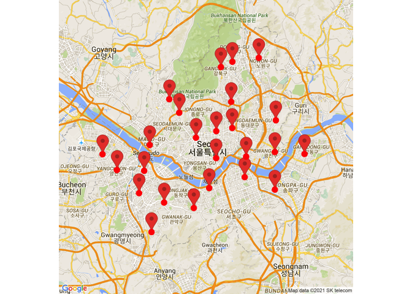<!-- -->

### 4.1. SO2 average

``` r
so2_dist <- measurement_summary %>% 
  select(Measurement.date, Station.code, Longitude, Latitude, SO2) %>% 
  group_by(Station.code, Longitude, Latitude) %>% 
  summarize(so2_avg = mean(SO2))

so2_cen <- c(mean(so2_dist$Longitude), mean(so2_dist$Latitude))

so2_map <- get_map(location = so2_cen, zoom = 11, maptype = "roadmap", source = 'google', color = 'color')

ggmap(so2_map) + 
  geom_point(aes(x = Longitude, y = Latitude, show_guide = TRUE, colour = so2_avg), 
             data = so2_dist, size = 5) +
  scale_color_gradient(low = "beige", high = "red") +
  labs(x = "Longitude", y= "Latitude") +
  labs(colour = "SO2 Average") +
  theme_void()
```

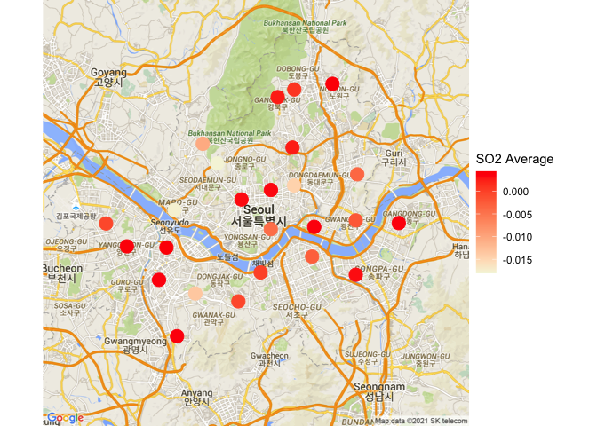<!-- -->

### 4.2. NO2 average

``` r
no2_dist <- measurement_summary %>% 
  select(Measurement.date, Station.code, Longitude, Latitude, NO2) %>% 
  group_by(Station.code, Longitude, Latitude) %>% 
  summarize(no2_avg = mean(NO2))

no2_cen <- c(mean(no2_dist$Longitude), mean(no2_dist$Latitude))

no2_map <- get_map(location = no2_cen, zoom = 11, maptype = "roadmap", source = 'google', color = 'color')

ggmap(no2_map) + 
  geom_point(aes(x = Longitude, y = Latitude, show_guide = TRUE, colour = no2_avg), 
             data = no2_dist, size = 5) +
  scale_color_gradient(low = "beige", high = "red") +
  labs(x = "Longitude", y= "Latitude") +
  labs(colour = "NO2 Average") +
  theme_void()
```

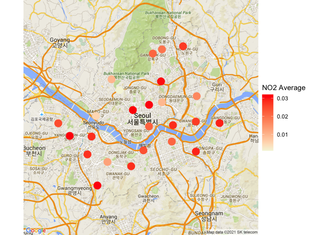<!-- -->

### 4.3. CO average

``` r
co_dist <- measurement_summary %>% 
  select(Measurement.date, Station.code, Longitude, Latitude, CO) %>% 
  group_by(Station.code, Longitude, Latitude) %>% 
  summarize(co_avg = mean(CO))

co_cen <- c(mean(co_dist$Longitude), mean(co_dist$Latitude))

co_map <- get_map(location = co_cen, zoom = 11, maptype = "roadmap", source = 'google', color = 'color')

ggmap(co_map) + 
  geom_point(aes(x = Longitude, y = Latitude, show_guide = TRUE, colour = co_avg), 
             data = co_dist, size = 5) +
  scale_color_gradient(low = "beige", high = "red") +
  labs(x = "Longitude", y= "Latitude") +
  labs(colour = "CO Average") +
  theme_void()
```

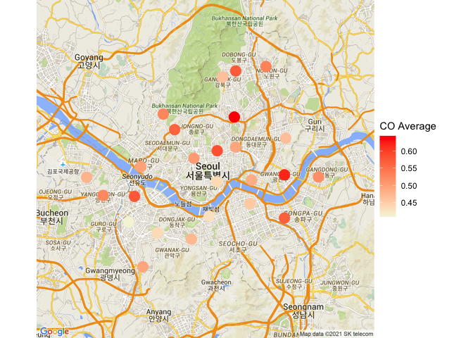<!-- -->

### 4.4. O3 average

``` r
o3_dist <- measurement_summary %>% 
  select(Measurement.date, Station.code, Longitude, Latitude, O3) %>% 
  group_by(Station.code, Longitude, Latitude) %>% 
  summarize(o3_avg = mean(O3))

o3_cen <- c(mean(o3_dist$Longitude), mean(o3_dist$Latitude))

o3_map <- get_map(location = o3_cen, zoom = 11, maptype = "roadmap", source = 'google', color = 'color')

ggmap(o3_map) + 
  geom_point(aes(x = Longitude, y = Latitude, show_guide = TRUE, colour = o3_avg), 
             data = o3_dist, size = 5) +
  scale_color_gradient(low = "beige", high = "red") +
  labs(x = "Longitude", y= "Latitude") +
  labs(colour = "O3 Average") +
  theme_void()
```

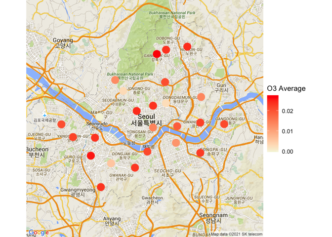<!-- -->

### 4.5. PM10 average

``` r
pm10_dist <- measurement_summary %>% 
  select(Measurement.date, Station.code, Longitude, Latitude, PM10) %>% 
  group_by(Station.code, Longitude, Latitude) %>% 
  summarize(pm10_avg = mean(PM10))

pm10_cen <- c(mean(pm10_dist$Longitude), mean(pm10_dist$Latitude))

pm10_map <- get_map(location = pm10_cen, zoom = 11, maptype = "roadmap", source = 'google', color = 'color')

ggmap(pm10_map) + 
  geom_point(aes(x = Longitude, y = Latitude, show_guide = TRUE, colour = pm10_avg), 
             data = pm10_dist, size = 5) +
  scale_color_gradient(low = "beige", high = "red") +
  labs(x = "Longitude", y= "Latitude") +
  labs(colour = "PM10 Average") +
  theme_void()
```

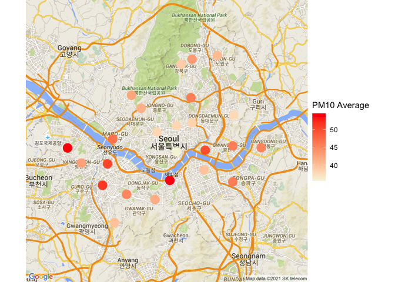<!-- -->

### 4.6. PM2.5 average

``` r
pm2.5_dist <- measurement_summary %>% 
  select(Measurement.date, Station.code, Longitude, Latitude, PM2.5) %>% 
  group_by(Station.code, Longitude, Latitude) %>% 
  summarize(pm2.5_avg = mean(PM2.5))

pm2.5_cen <- c(mean(pm2.5_dist$Longitude), mean(pm2.5_dist$Latitude))

pm2.5_map <- get_map(location = pm2.5_cen, zoom = 11, maptype = "roadmap", source = 'google', color = 'color')

ggmap(pm2.5_map) + 
  geom_point(aes(x = Longitude, y = Latitude, show_guide = TRUE, colour = pm2.5_avg), 
             data = pm2.5_dist, size = 5) +
  scale_color_gradient(low = "beige", high = "red") +
  labs(x = "Longitude", y= "Latitude") +
  labs(colour = "PM2.5 Average") +
  theme_void()
```

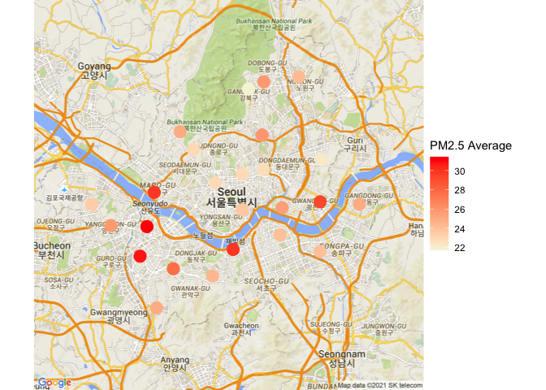<!-- -->

## Correlation

``` r
library(corrplot)
data_cor <- measurement_summary %>% select(-c(Address, Latitude, Longitude))
data_cor$year <- format(as.Date(data_cor$Measurement.date), "%Y")
data_cor <- data_cor %>% select(-Measurement.date)
```

### Data from 2017 to 2019

``` r
data_cor_new <- data_cor %>% select(-year)
cor(data_cor_new)
```

    ##              Station.code        SO2        NO2         O3          CO
    ## Station.code   1.00000000 0.02752721 0.02152603 0.01899121 -0.03475057
    ## SO2            0.02752721 1.00000000 0.71242206 0.80555076  0.30492255
    ## NO2            0.02152603 0.71242206 1.00000000 0.78580546  0.24574569
    ## O3             0.01899121 0.80555076 0.78580546 1.00000000  0.18899824
    ## CO            -0.03475057 0.30492255 0.24574569 0.18899824  1.00000000
    ## PM10           0.03014317 0.04857326 0.05553220 0.03860241  0.15116623
    ## PM2.5          0.01742220 0.04753109 0.05784391 0.03386835  0.18286683
    ##                    PM10      PM2.5
    ## Station.code 0.03014317 0.01742220
    ## SO2          0.04857326 0.04753109
    ## NO2          0.05553220 0.05784391
    ## O3           0.03860241 0.03386835
    ## CO           0.15116623 0.18286683
    ## PM10         1.00000000 0.22898359
    ## PM2.5        0.22898359 1.00000000

``` r
corrplot(cor(data_cor_new))
```

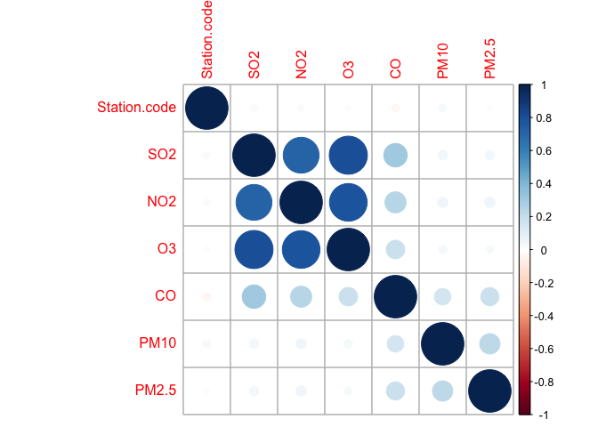<!-- -->

  - There is a moderate positive relationship between SO2 and NO2  
  - There is a fairly strong positive relationship between SO2 and O3  
  - There is a fairly strong positive relationship between O3 and NO2

### Data for 2017

``` r
data_cor_2017 <- data_cor %>% filter(year == 2017) %>% select(-year)
cor(data_cor_2017)
```

    ##              Station.code        SO2         NO2          O3         CO
    ## Station.code  1.000000000 0.01118673 0.001483703 0.003953476 0.00519354
    ## SO2           0.011186733 1.00000000 0.913670116 0.788477063 0.16162065
    ## NO2           0.001483703 0.91367012 1.000000000 0.653637473 0.28787039
    ## O3            0.003953476 0.78847706 0.653637473 1.000000000 0.03177962
    ## CO            0.005193540 0.16162065 0.287870389 0.031779620 1.00000000
    ## PM10          0.027585552 0.03885126 0.094275170 0.040529027 0.14969395
    ## PM2.5         0.002494994 0.07472349 0.220743142 0.041813396 0.37898747
    ##                    PM10       PM2.5
    ## Station.code 0.02758555 0.002494994
    ## SO2          0.03885126 0.074723493
    ## NO2          0.09427517 0.220743142
    ## O3           0.04052903 0.041813396
    ## CO           0.14969395 0.378987473
    ## PM10         1.00000000 0.367376282
    ## PM2.5        0.36737628 1.000000000

``` r
corrplot(cor(data_cor_2017))
```

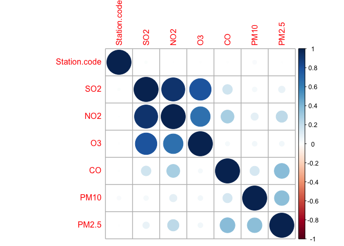<!-- -->

  - There is a strong positive relationship between SO2 and NO2  
  - There is a fairly strong positive relationship between SO2 and O3  
  - There is a moderate positive relationship between O3 and NO2

### Data for 2018

``` r
data_cor_2018 <- data_cor %>% filter(year == 2018) %>% select(-year)
cor(data_cor_2018)
```

    ##              Station.code        SO2        NO2         O3          CO
    ## Station.code   1.00000000 0.05262644 0.02851859 0.03197359 -0.02377682
    ## SO2            0.05262644 1.00000000 0.51284308 0.63476036  0.29680509
    ## NO2            0.02851859 0.51284308 1.00000000 0.71389669  0.16548591
    ## O3             0.03197359 0.63476036 0.71389669 1.00000000  0.13265287
    ## CO            -0.02377682 0.29680509 0.16548591 0.13265287  1.00000000
    ## PM10           0.03828139 0.03836903 0.03480850 0.02126285  0.14925481
    ## PM2.5          0.01541633 0.04005973 0.03775670 0.01860968  0.18715744
    ##                    PM10      PM2.5
    ## Station.code 0.03828139 0.01541633
    ## SO2          0.03836903 0.04005973
    ## NO2          0.03480850 0.03775670
    ## O3           0.02126285 0.01860968
    ## CO           0.14925481 0.18715744
    ## PM10         1.00000000 0.18430513
    ## PM2.5        0.18430513 1.00000000

``` r
corrplot(cor(data_cor_2018))
```

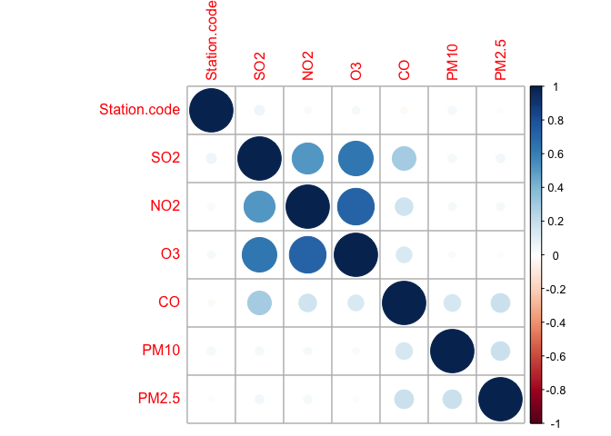<!-- -->

  - There is a moderate positive relationship between SO2 and NO2  
  - There is a moderate positive relationship between SO2 and O3  
  - There is a faily strong positive relationship between O3 and NO2

### Data for 2019

``` r
data_cor_2019 <- data_cor %>% filter(year == 2019) %>% select(-year)
cor(data_cor_2019)
```

    ##              Station.code        SO2        NO2         O3          CO
    ## Station.code   1.00000000 0.01959449 0.02544047 0.01424683 -0.07991444
    ## SO2            0.01959449 1.00000000 0.98767919 0.96877780  0.38597177
    ## NO2            0.02544047 0.98767919 1.00000000 0.94710511  0.40000665
    ## O3             0.01424683 0.96877780 0.94710511 1.00000000  0.32310081
    ## CO            -0.07991444 0.38597177 0.40000665 0.32310081  1.00000000
    ## PM10           0.02468474 0.06245947 0.08362525 0.05893944  0.15560664
    ## PM2.5          0.02691368 0.05178964 0.07042286 0.04902037  0.14922628
    ##                    PM10      PM2.5
    ## Station.code 0.02468474 0.02691368
    ## SO2          0.06245947 0.05178964
    ## NO2          0.08362525 0.07042286
    ## O3           0.05893944 0.04902037
    ## CO           0.15560664 0.14922628
    ## PM10         1.00000000 0.24716750
    ## PM2.5        0.24716750 1.00000000

``` r
corrplot(cor(data_cor_2019))
```

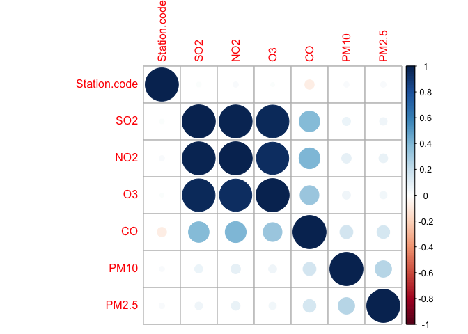<!-- -->

  - There is a strong positive relationship between SO2 and NO2  
  - There is a strong positive relationship between SO2 and O3  
  - There is a strong positive relationship between O3 and NO2
